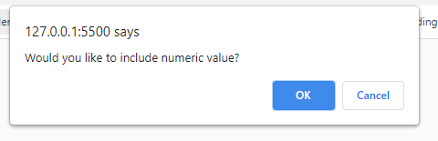

# 03 JavaScript: Password Generator

## Task Description:
In this project (Password Generator), we require some modification in order to generate a password.

Our clint wanted to access  to sensitive data and wanted to generate a password that meets certain criteria and have a strong password that provides greater security.

## Changes in JavaScript file:

### These are an array of useful variables numbers, lowerCaseLetter, uppercaseLetter,, and spclChars:

```JavaScript
var numbers = [0,1,2,3,4,5,6,7,8,9];
var lowerCaseLetter = ['a', 'b', 'c', 'd', 'e', 'f', 'g', 'h', 'i', 'j', 'k', 'l', 'm', 'n', 'o', 'p', 'q', 'r', 's', 't', 'u', 'v', 'w', 'x', 'y', 'z'];
var upperCaseLetter = ['A', 'B', 'C', 'D', 'E', 'F', 'G', 'H', 'I', 'J', 'K', 'L', 'M', 'N', 'O', 'P', 'R', 'S', 'T', 'U', 'V', 'W', 'X', 'Y', 'Z'];
var spclChars = ['!','@','#','$','%','&','*','(',')','{','['];
```

### Creating a variable called generateBtn and selecting an Id called generate from HTML document.

```JavaScript
var generateBtn = document.querySelector("#generate");
```

### Writing a function from user password prompts and returning an object responseOblect

```JavaScript
function passwordPrompts() {
  var userInput = prompt("Please choose a length of at least 8 characters and no more than 128 characters.");
  var lowerCase = confirm("Would you like to include lowercase letter?");
  var upperCase = confirm("Would you like to include uppercase letter?");
  var numericValue = confirm("Would you like to include numeric value?");
  var specialChars = confirm("Would you like to include special characters?");
  var responseObject = {
    userInput, 
    lowerCase, 
    upperCase, 
    numericValue, 
    specialChars
  }
  return responseObject;
}
```

### This function will generate a randon password

```JavaScript
function generatePassword(responseObject) {
  var userSelection = [];
  var password = [];
  if (responseObject.numericValue === true) {
    userSelection = userSelection.concat(numbers);
  }
  if (responseObject.lowerCase === true) {
    userSelection = userSelection.concat(lowerCaseLetter);
  }
  if (responseObject.upperCase === true) {
    userSelection = userSelection.concat(upperCaseLetter);
  }
  if (responseObject.specialChars === true) {
    userSelection = userSelection.concat(spclChars);
  }

  for (var i = 0; i < responseObject.userInput; i++) {
    var randomCharacter = userSelection[Math.floor(Math.random() * userSelection.length)];
    password = password.concat(randomCharacter);
  }

  return password.join('')
}
```


## Mock-up

The following images shows the web application's appearance and functionality:

1) This is the home page or first page when loded. The user will be able to click the red button "Generate Password" to generate a new secure password.


2) This is the mock-up once user click the "Generate Password" button user will be prompted to enter a password length.


3) This is other mock-up image to confirm whether the user want to use a lowercase letter or not.


4) This mock-up image shows whether the user want to use a uppercase letter or not.


5) This mock-up shows the user to confirm whether the user want to use a numeric value or not.



6) This mock-up image will allow user to confirm whether the user want to use a special character or not.


7) The last and the main screen with new and secure password in the box.


